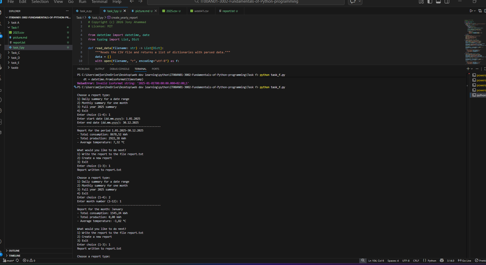

---
Choose a report type:
1) Daily summary for a date range
2) Monthly summary for one month
3) Full year 2025 summary
4) Exit
Enter choice (1-4): 1
Enter start date (dd.mm.yyyy): 1.01.2025
Enter end date (dd.mm.yyyy): 30.12.2025
-----------------------------------------------------
Report for the period 1.01.2025–30.12.2025
- Total consumption: 8678,52 kWh
- Total production: 2922,38 kWh
- Average temperature: 7,32 °C

What would you like to do next?
1) Write the report to the file report.txt
2) Create a new report
3) Exit
Enter choice (1-3): 1
Report written to report.txt

Choose a report type:
1) Daily summary for a date range
2) Monthly summary for one month
3) Full year 2025 summary
4) Exit
Enter choice (1-4): 2
Enter month number (1–12): 1
-----------------------------------------------------
Report for the month: January
- Total consumption: 1545,24 kWh
- Total production: 0,00 kWh
- Average temperature: -1,82 °C

What would you like to do next?
1) Write the report to the file report.txt
2) Create a new report
3) Exit
Enter choice (1-3): 1
Report written to report.txt

Choose a report type:
1) Daily summary for a date range
2) Monthly summary for one month
3) Full year 2025 summary
4) Exit
Enter choice (1-4): 3
-----------------------------------------------------
Report for the year: 2025
- Total consumption: 8741,12 kWh
- Total production: 2922,38 kWh
- Average temperature: 7,26 °C

What would you like to do next?
1) Write the report to the file report.txt
2) Create a new report
3) Exit
Enter choice (1-3): 1
Report written to report.txt

Choose a report type:
1) Daily summary for a date range
2) Monthly summary for one month
3) Full year 2025 summary
4) Exit
Enter choice (1-4): 3
-----------------------------------------------------
Report for the year: 2025
- Total consumption: 8741,12 kWh
- Total production: 2922,38 kWh
- Average temperature: 7,26 °C

What would you like to do next?
1) Write the report to the file report.txt
2) Create a new report
3) Exit
Enter choice (1-3): 1
Report written to report.txt

Choose a report type:
1) Daily summary for a date range
2) Monthly summary for one month
3) Full year 2025 summary
4) Exit
Enter choice (1-4): 1
Enter start date (dd.mm.yyyy): 11.12.2025
Enter end date (dd.mm.yyyy): 30.12.2025
-----------------------------------------------------
Report for the period 11.12.2025–30.12.2025
- Total consumption: 910,82 kWh
- Total production: 0,00 kWh
- Average temperature: 0,64 °C

What would you like to do next?
1) Write the report to the file report.txt
2) Create a new report
- Total production: 0,00 kWh
- Average temperature: 0,64 °C

What would you like to do next?
1) Write the report to the file report.txt
- Total production: 0,00 kWh
- Average temperature: 0,64 °C

What would you like to do next?
- Total production: 0,00 kWh
- Average temperature: 0,64 °C

- Total production: 0,00 kWh
- Average temperature: 0,64 °C
- Total production: 0,00 kWh
- Total production: 0,00 kWh
- Total production: 0,00 kWh
- Total production: 0,00 kWh
- Average temperature: 0,64 °C
- Total production: 0,00 kWh
- Total production: 0,00 kWh
- Total production: 0,00 kWh
- Average temperature: 0,64 °C

What would you like to do next?
1) Write the report to the file report.txt
2) Create a new report
3) Exit
Enter choice (1-3): 1
Report written to report.txt

Choose a report type:
1) Daily summary for a date range
2) Monthly summary for one month
3) Full year 2025 summary
4) Exit
Enter choice (1-4):